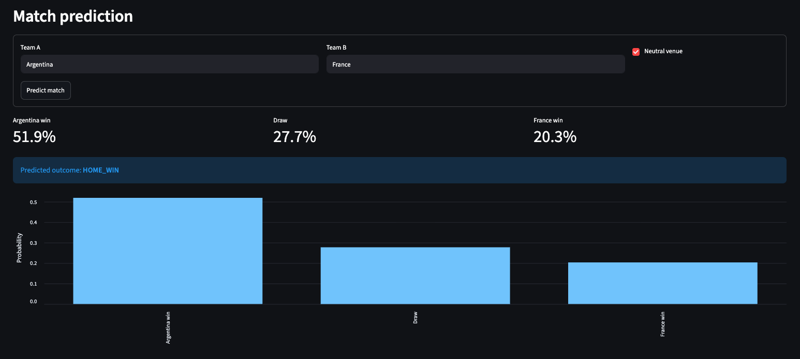
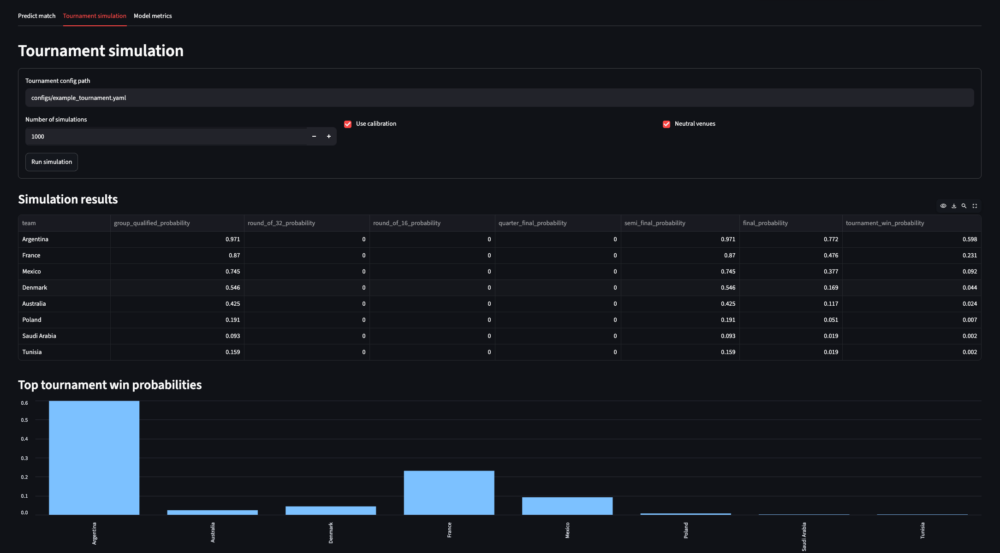
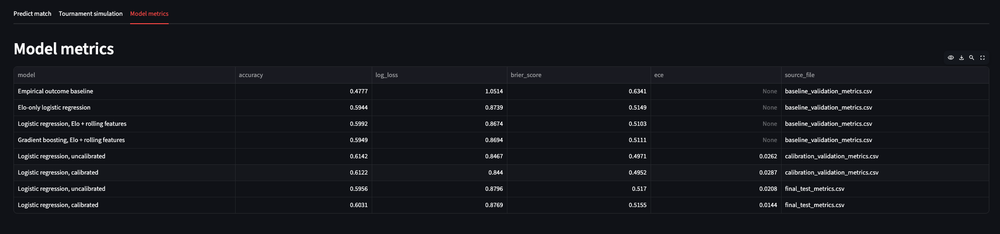
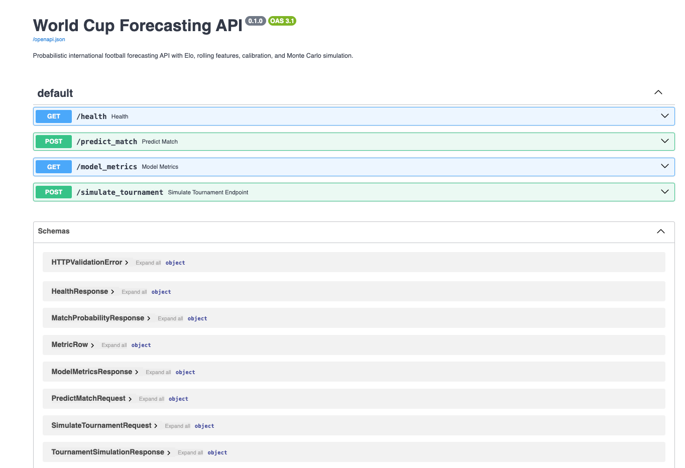

# World Cup Forecasting and Simulation Platform

Probabilistic forecasting and simulation platform for international football tournaments.

This project treats football forecasting as a probabilistic forecasting and simulation problem, emphasizing chronological validation, leakage avoidance, calibrated probabilities, proper scoring rules, and Monte Carlo tournament simulation.

## What This Project Does

The platform predicts international football match outcomes as probabilities, not single-point guesses. It then uses those probabilities to run tournament simulations and estimate how often teams reach each stage or win the tournament.

The project includes:

- A reproducible data pipeline for historical international match results
- Sequential Elo ratings and causal rolling-form features
- Chronological train/validation/test splits to reduce leakage
- Baseline and machine learning model comparison
- Probability calibration and reliability analysis
- Monte Carlo tournament simulation from YAML tournament configs
- FastAPI endpoints for prediction, metrics, and simulation
- A Streamlit dashboard for interactive demos
- Docker Compose support for running the API and dashboard together

## Screenshots

### Match prediction dashboard



### Tournament simulation dashboard



### Model metrics dashboard



### FastAPI documentation



## Why It Matters

Football is noisy. A good forecasting system should not just say “Argentina will win.” It should say something closer to:

```text
Argentina win: 61%
Draw:          24%
Opponent win: 15%
```

That makes the output useful for simulation, comparison, calibration, and decision-making. This project is built around that idea: probabilities first, tournament outcomes second.

## Architecture

```text
raw match results
  -> cleaned chronological dataset
  -> sequential Elo features
  -> rolling team-form features
  -> model training and validation
  -> probability calibration
  -> match prediction API
  -> Monte Carlo tournament simulation
  -> Streamlit dashboard
```

Core modules:

- `src/wc_forecast/data/`: cleaning, splitting, rolling features
- `src/wc_forecast/ratings/`: Elo ratings
- `src/wc_forecast/models/`: baselines, sklearn models, calibration, evaluation
- `src/wc_forecast/simulation/`: match, group-stage, knockout, and tournament simulation
- `src/wc_forecast/api/`: FastAPI app and service layer
- `src/wc_forecast/dashboard/`: Streamlit interface
- `configs/`: YAML tournament configs
- `scripts/`: reproducible pipeline and evaluation commands
- `tests/`: regression tests for data, models, simulation, API, and calibration

## Model Results

Validation model comparison:

| Model | Accuracy | Log loss | Brier score |
|---|---:|---:|---:|
| Empirical outcome baseline | 0.478 | 1.051 | 0.634 |
| Elo-only logistic regression | 0.594 | 0.874 | 0.515 |
| Logistic regression, Elo + rolling features | 0.599 | 0.867 | 0.510 |
| Gradient boosting, Elo + rolling features | 0.595 | 0.869 | 0.511 |

Final test evaluation:

| Model | Accuracy | Log loss | Brier score | ECE |
|---|---:|---:|---:|---:|
| Logistic regression, uncalibrated | 0.596 | 0.880 | 0.517 | 0.0208 |
| Logistic regression, calibrated | 0.603 | 0.877 | 0.515 | 0.0144 |

The calibrated logistic model is the main model used by the API and tournament simulation.

## Run Locally

Install the package with development dependencies:

```bash
pip install -e ".[dev]"
```

Run the full data and evaluation pipeline:

```bash
python scripts/prepare_data.py
python scripts/build_elo_features.py
python scripts/build_features.py
python scripts/evaluate_baselines.py
python scripts/calibrate_model.py
python scripts/evaluate_final_model.py
```

Run a model-backed tournament simulation:

```bash
python scripts/run_model_simulation.py --config configs/example_tournament.yaml
```

Run tests:

```bash
pytest
```

## Run the API

```bash
uvicorn wc_forecast.api.main:app --reload
```

Open:

```text
http://localhost:8000/docs
```

Useful endpoints:

- `GET /health`
- `POST /predict_match`
- `GET /model_metrics`
- `POST /simulate_tournament`

Example match prediction request:

```bash
curl -X POST "http://localhost:8000/predict_match" \
  -H "Content-Type: application/json" \
  -d '{"home_team": "Argentina", "away_team": "France", "neutral": true}'
```

## Run the Dashboard

```bash
streamlit run src/wc_forecast/dashboard/app.py
```

Open:

```text
http://localhost:8501
```

The dashboard can:

- Predict a match
- Run a tournament simulation
- Display model metrics

## Run with Docker Compose

Make sure Docker Desktop is running, then:

```bash
docker compose up --build
```

Open:

```text
API docs:  http://localhost:8000/docs
Dashboard: http://localhost:8501
```

The Compose setup mounts `data/`, `reports/`, and `configs/` into the containers. Run the data pipeline first if those files are missing.

## Tournament Simulation

Tournament setup lives in YAML files such as:

```text
configs/example_tournament.yaml
```

The simulator:

- Builds group-stage fixtures from config
- Gets match probabilities from the trained model provider
- Simulates group standings
- Simulates knockout rounds
- Repeats the tournament many times
- Reports stage and title probabilities

The example config is intentionally small, so a team that qualifies from the group immediately reaches the semifinal. Full-size tournament configs can be added using the same structure.

## Engineering Notes

This project pays particular attention to:

- Chronological validation instead of random splitting
- Causal features that use only information available before each match
- Probability calibration and proper scoring rules
- Tests for simulation logic, model probability order, API behavior, and config loading
- Separation between model training, serving, and simulation

## Limitations

The model uses historical match-level data only. It does not currently include player injuries, squad announcements, bookmaker odds, tactical context, travel, rest, or competition-specific squad strength. Group-stage tie-breaks are simplified, and knockout draws are resolved with a simple random tie-break after simulated draws.

This project is intended as a forecasting and engineering portfolio project, not as a betting system.

## Future Work

- Add full 48-team World Cup configs
- Add scoreline or Poisson-based simulation
- Improve group tie-break rules
- Add richer features such as squad strength or FIFA ranking history
- Add uncertainty intervals around tournament probabilities
- Deploy the API and dashboard to a cloud environment
